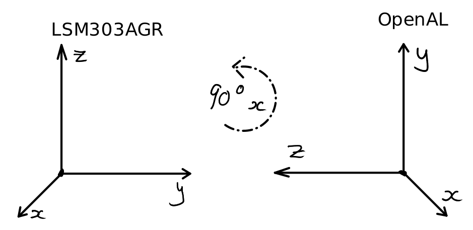

# Binaural Sensory Augmentation Repository

This project is a master's project by Nathan Phipps O'Neill. The code in this 
 repository aims to interact with a GPS, magnetometer and headphones to augment
 a human's navigational ability with audio.

## Wiki
For a complete bash history of the setup, see HISTORY.txt. **Note:** *Most of the* 
*commands in HISTORY.txt are redundant but could be a useful reference for anyone* 
*who may be confused.*

### Sensor Mount
The sensor mount STL can be sound in SENSOR_MOUNT.stl and should be printed with TPU so 
that the underside of the mount will wrap around the headset for rigidity.

### Setup of I2C interface
The project was built on a Raspberry Pi 3 B+ with Raspbian OS (and Raspbian Lite OS)
 and I2C functionality enabled. To enable I2C functionality, first type 
 ```
 sudo raspi-config
 ```  
 into the terminal and select 
 `Interface Options > I2C > Yes`.

### OpenAL soft configuration
Install OpenAL with:  
```
sudo apt-get install libalut0 libalut-dev
```    
Then create an openal configuration file in the home directory:  
```
sudo nano .alsoftrc
```    
... and place the following text into the nano text editor:  
```
[alsa]
mmap = false
```  
This may or may not be needed, but for a clean install on Raspbian lite it was 
needed on Aug 22 2021.  
To save the file, hit `CTRL+X` on the keyboard, then `Y` to save and `ENTER` to 
confirm.


### (Prerequisite) Building the project
Familiarise yourself with `cmake` as it is the build tool of choice for this 
project. Briefly, cmake is a tool to manage building of source code and allows 
the project to implement a scalable and structured code base. It also allows 
implementing test functionality and managing 3rd party dependencies with 
relative ease (depending on your experience level of cmake).  

### Using a beacon
A .wav file is used in this project as a beacon. The literature shows that wide 
spectrum sound clips are best for locating a sound source. An audio clip of sparrows 
with faint background machinary can be used as an effective beacon sound.

### Building the project
To build the project do these steps (where `<project_root_dir>` is the place 
where the project was installed/cloned to):
```
cd <project_root_dir>/build
make clean
make
```  
If this does not work, change into the build directory and clear it as follows:
```
cd <project_root_dir>/build
rm -rf *
cmake ..
```  
Then make sure that the NMEAParser Library is added to your include path. This 
should happen automatically after building the NMEAParser library.

### Example of an NMEA GGA sentence
`
$GNGGA,1413,14.083,,,,,0,0,,,M,,M,,*5F
`
### The NMEA parser
A 3rd party NMEA parser is used to parse the sentence from the PA1010D. This 
will simplify the process of getting numerical values from textual data. 
The NMEAParser was downloaded on July 18 2021 but that version should be 
contained within this project as the licence permits it.  

More on this project can be found 
[here](https://github.com/VisualGPS/NMEAParser):  
https://github.com/VisualGPS/NMEAParser

If the parser library is modified at all or this is the first 
time running the program, these steps must be taken for 
the changes to take effect:  
```
cd <project_root_dir>/lib/NMEAParser/NMEAParserBuild
cmake ../Software/
make
cd <project_root_dir>/build
make clean
make
```  

### The difference in Axes
With OpenAL and the real world, the listener and source objects are located in 3D 
space. With the LSM303AGR magnetometer, the axes are oriented in a different way to 
the OpenAL framework. This difference is important when converting between the two 
coordinate systems. To convert between the two, change the *y* axis in the 
magnetometers coordinate system to the *-z* axis in the OpenAL coordinate system, 
**and** change the *z* axis in the magnetometers coordinate system to the *y* axis 
in the OpenAL coordinate system. This is a 90 degree rotation about the *x* axis. 


